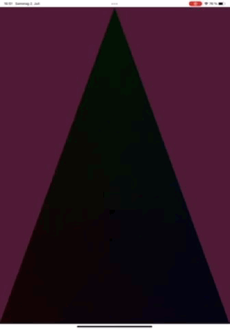

# MetalRT
Ray tracing with Metal. A lab to explore various ray tracing implementations with [Metal](https://developer.apple.com/metal/).

## Usage
- Setup new app in SP4
- Delete `*.swift` files
- Delete predefined *.swift files in app
- Add `shader.msl` files with SP4 as resource
- Create file `MetalHW.swift` :

  ```
  ```

## Result


--

### Tools
Apps used on iPad
- [Swift Playgrounds 4](https://apps.apple.com/de/app/swift-playgrounds/id908519492)
- [Working Copy](https://workingcopyapp.com/)
- [Textastic](https://www.textasticapp.com/) (can edit SP4 `.swiftpm` files)
- [GitHub](https://apps.apple.com/us/app/github/id1477376905)

Apps used on Winos 10
- [Cygwin](https://cygwin.com/install.html) with development tools
- [Swift on Windows](https://www.swift.org/blog/swift-on-windows/) 5.6

### Setup
- Install [Cygwin](https://cygwin.com/install.html) with development tools (for what it's good for)
- [Install Swift on Windows](https://www.swift.org/getting-started/) (according to *Traditional Installation* section)
- Create repository on GitHub (default settings)
- Clone repository from GitHub

  **Cygwin command prompt (bash)**
  ```
  git clone https://github.com/otabuzzman/MetalRT
  # use SSH (optional)
  # git clone git://github.com/otabuzzman/MetalRT

  cd MetalRT
  ```
- Create SSH keys (optional)
  ```
  ssh-keygen -t ed25519 -C iuergen.schuck@gmail.com -f ~/.ssh/github.com.MetalRT
  chmod 400 ~/.ssh/github.com.MetalRT
  ```
- Swift package initialization

  **Winos command prompt (CMD)**
  ```
  cd MetalRT

  swift package init

  rem check
  swift build
  ```
- Sync package with GitHub

  **Cygwin command prompt (bash)**
  ```
  # enable SSH key usage for session
  # eval "$(ssh-agent -s)"
  # ssh-add ~/.ssh/github.com.MetalRT

  git add -A
  git push origin main

  # tag required to load package with SP4
  git tag -a 0.1.0 -m 'initial commit'
  git push origin 0.1.0
  ```

### Which file for what
|File|Comment|
|:---|:------|
|`CUIView.swift`|A SwiftUI wrapper for custom UIViews.|
|`MUIView.swift`|A custom MTKView.|
|`MUIRenderer.swift`|A boilerplate renderer to be used with MUIView.|
|`MHWRenderer.swift`|A _Hello World_ renderer sub-classed from MUIRenderer.|
|`Wavefront.swift`|A class to read a Wavefront OBJ file.|
|`XPU.swift`|Types shared between CPU and GPU.|
|`Exception.swift`|Error exceptions.|
|`Extension.swift`|SwiftUI classes and protocols extensions.|
|`shader.msl`|Simple pass-through vertex and vragment shader functions.|

### Findings
- No `.metal` file support in SP4. Metal Shader Language (MSL) code via `String` class in Swift source files (e.g. ending on `.metal.swift`) ok for SP4 playgrounds and apps. The latter allows MSL files as resources. File suffixes must have three characters (e.g. `.msl`). Otherwise (e.g. when using `.metal` suffix) SP4 will report an unknown resource error on app open.
- Removing resource files only make them disappear in file system but app still works as if they remain present.
